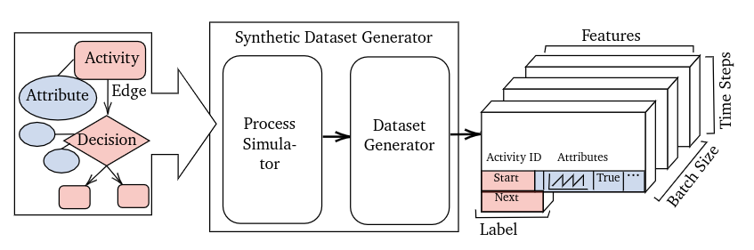
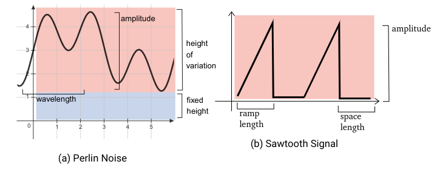
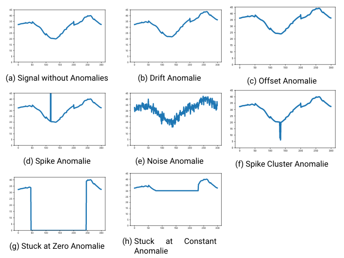
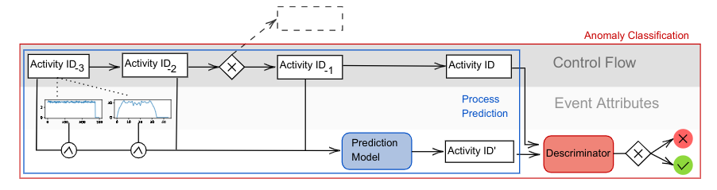
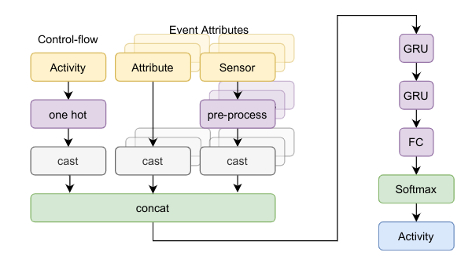
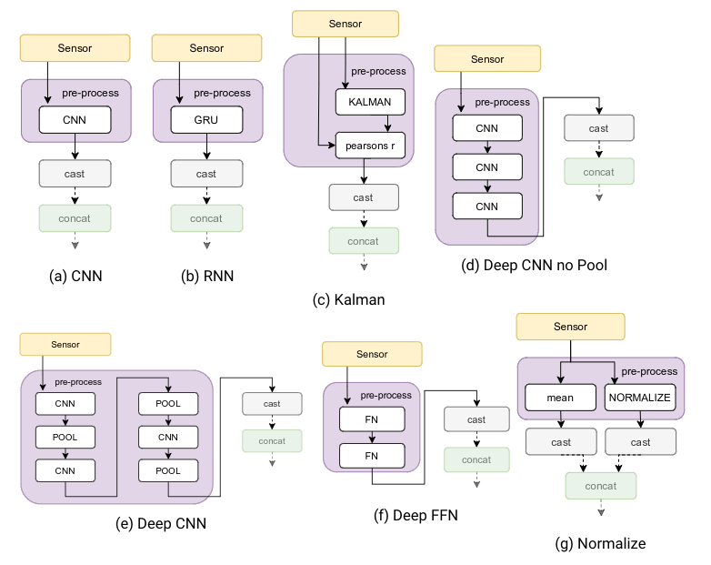

# Project to simulate and learn Business Processes containing Sensor Data

This project presents the first business process mining framework that can encorporate sensor data for the control flow prediction.

It is the outcome of the my master thesis: _Business Process Anomaly Classification Utilizing Sensor Data_
. The research can be found [here](thesis.pdf). 

The project is split in two parts, the [dataset generator](#synthetic-dataset-generator) and the tensor-flow based [process mining framework](#process-mining).

## Project Overview

Some of the experiments have been called within jupyter notebooks, others with python scripts whenever the task was very memory intense.

The code for the [dataset generator](#synthetic-dataset-generator) can be found at `code/ProcessSimulator`.
The code to simulate processes can be found at `code/ProcessSimulator/simulator` 
`code/ProcessSimulator/processes` contains three implementations of example processes of which two have been presented in chapter 5.3 in the [thesis](thesis.pdf).

All Tensorflow based ML code for the [process mining framework](#process-mining) is located at `code/SensorNet`.

The experiments and evaluation Scripts can be found at `code/scripts`.

Furthermore, the `code` contains additional classes and utilities that are used for the experiments.

## System Overview

### Synthetic Dataset Generator
The Synthetic Dataset Generator is composed by two sub-systems, the **Process Simulator** and **the Dataset Generator**.
The task of theProcess Simulator is to generate an eventlog by simulating a defined process graph. 
The Dataset Generator takes the event log and converts it into the desired dataset for the experiment. 

**The Process Simulator** is configured by the process graph, the number of instances to generate and the maximal instance depth. 
This parameter ensures that the number of events in one instance is maximal of this depth size. 
If this limit is passed, the instance is yielded even though it did not reach the end of the process graph.

The simulated sensor signal can be generated by an arbitrarily complex function. 
One of the provided signal simulators is the **spaced sawtooth signal wave** and **perlin noise**. 

The dataset generator has two major roles, applying anomalies on the event log and shaping the log into a dataset for a prediction task.
Flow anomalies alter the process flow in the event log whereas sensor anomalies change event attributes with sensor data.
#### Flow Anomalies 
* **Skip**: A event sequence of up to 3 events is deleted.
* **Rework**: A event sequence of up to 3 events is duplicated.

#### SensorAnomalies
* **Drift**: positive or negative gradual change in values to the signal
* **Noise**: Values oscillate considerably
* **Spike**: One Anomalous value is higher or lower than surrounding data
* **Offset**: Values are wrong by some constant
* **Spike Cluster**: Multiple spikes in a short period of time
* **Stuck at Zero**: Sudden period of zero values
* **Stuck at Constant**: Sudden constant period of the last value in a period with variance

For a extensive documentation please refer to **chapter 4** in the [thesis](thesis.pdf). 

### Process Mining 
The process mining framework can be used for **process prediction** and **anomaly classification**.

The process prediction model is trained to predict the probability of the next event in a given event log.
This model can be used for various process prediction tasks like forecasting or simulation.

To be able to detect anomalies, the process prediction model is extended with a **discriminator** component. 
At first prediction model forecasts how a process should be executed. 
The discriminator then compares this prediction and the actual data to determine whether the execution was anomalous.

The components in the blue box are needed to use the system for a process prediction task whereas anomaly detection needs the components in the red box.

#### Prediction Model

All event inputs are pre-processed and concatenated in an input pipeline and fed into an RNN network for the next event prediction task. 
The core RNN network is represented by a two-layer GRU with batch normalization after each layer to avoid over-fitting. 
The output of the RNN network is fed into a fully connected output layer to predict the one-hot encoded id of the next activity with asoftmax activation function

The model can be configured with different pre-processing layers:

You can find further documentation in **chapter 5** of the [thesis](thesis.pdf).